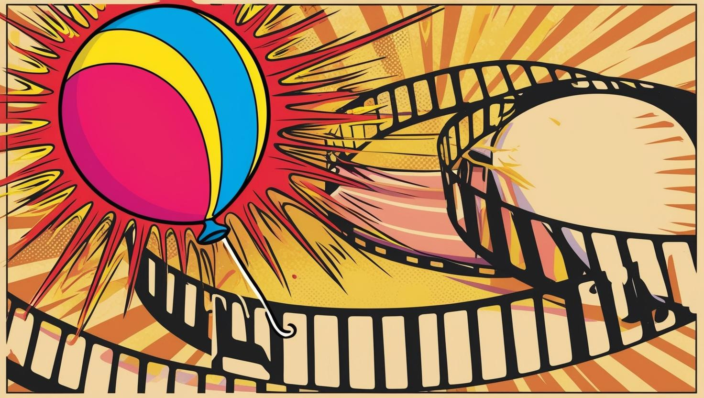

# PopReel - TikTok-Style App

PopReel is a fun and engaging platform that allows users to share short videos with each other, similar to TikTok. Whether you're into dancing, comedy, or showcasing your creativity, PopReel gives you the freedom to express yourself through videos. With a sleek and user-friendly interface, you can easily browse, like, and share content with others.

---

### Tech Stack
Next.js: A powerful React framework for building fast, scalable, and user-friendly web applications.
Clerk: For secure and easy authentication, allowing users to sign in and manage their accounts.
Supabase: The backend platform for storing and managing video files, user data, and other app-related content.

---

Features
- Video Sharing: Upload, watch, and share fun videos with the community.
- Authentication: Secure user authentication using Clerk for easy sign-ups and log-ins.
- Likes & Comments: Engage with videos by liking and commenting to connect with others.
- Profile Management: Each user has their own profile to manage videos and personal details. (coming soon!)
- Real-Time Feed: Explore an endless stream of content tailored to your interests. (coming soon!)
